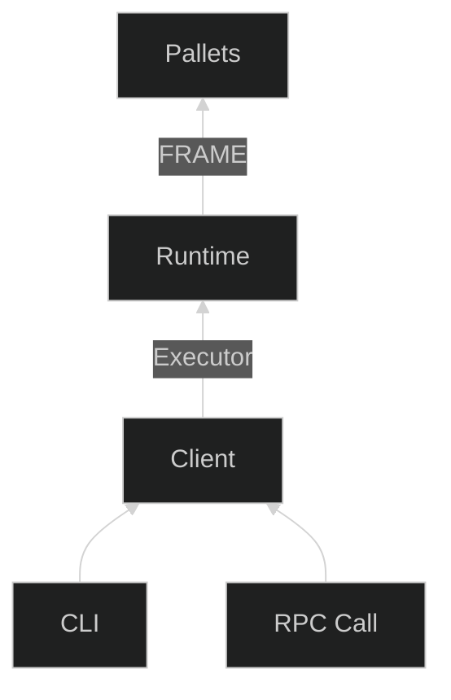

# Architecture and repo layout

This chapter is intended to give a sense of the individual pieces in a creditcoin node, how
the pieces fit together, and where the code for those pieces live. For the most part,
this will talk about the components a creditcoin developer actually interacts with
and won't go in-depth into underlying components (like substrate internals).

The main components of a `creditcoin-node` are the [client](./architecture/client.md) and
the [runtime](./architecture/runtime/runtime.md). The user / node operator interacts with the client
through either the CLI or RPC calls. The client calls into the runtime as needed
using an executor (part of substrate). The runtime is composed using the FRAME
modular framework, which enables reusable modules called _pallets_. The majority
of creditcoin's business logic is split across a variety of pallets.

