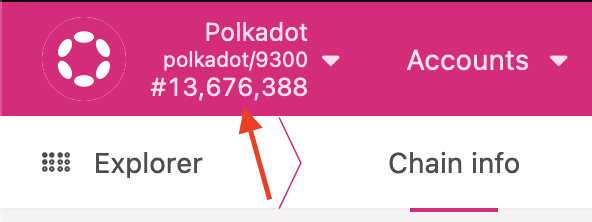
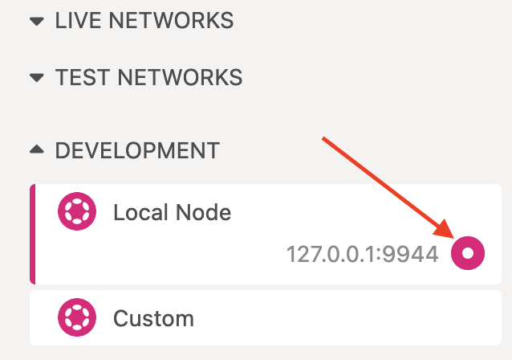
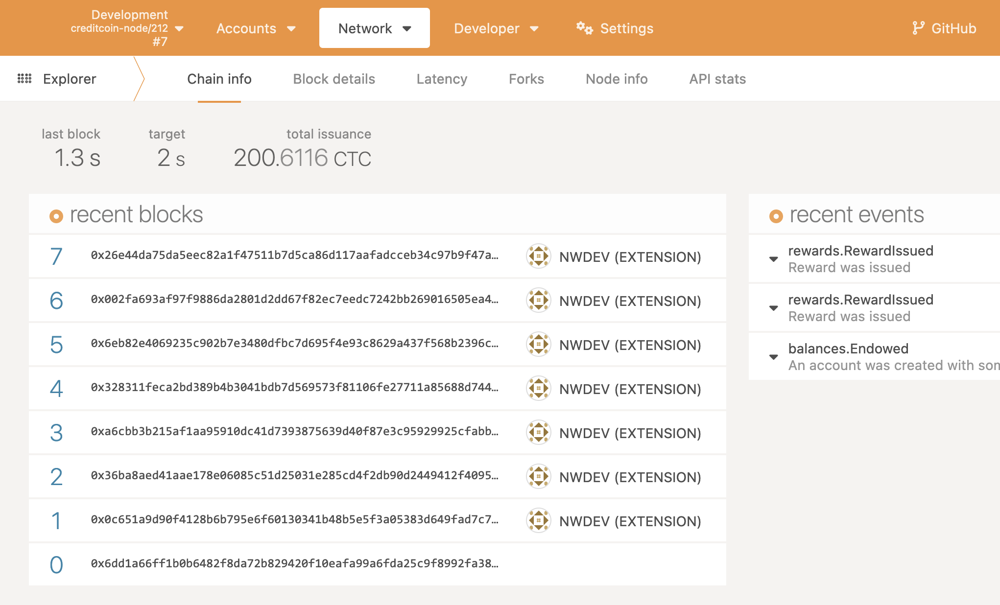

# Observing the development chain

With a node up and running, it's often useful to inspect the status of the development chain. The Polkadot explorer is
the easiest way to take a look at a live chain.

In your browser, open up [the Polkadot explorer](https://polkadot.js.org/apps). Now you'll want to point the explorer at your running
development node. In the top left corner, there's a menu accessible by clocking the name of the current chain:

In the newly opened menu, expand the `Development` section at the bottom, then select "Local Node":

Finally click the Switch button at the top of the chain selection menu:

The explorer should now show the chain running on your local node, and new blocks should be appearing regularly (every 5-30 seconds):

